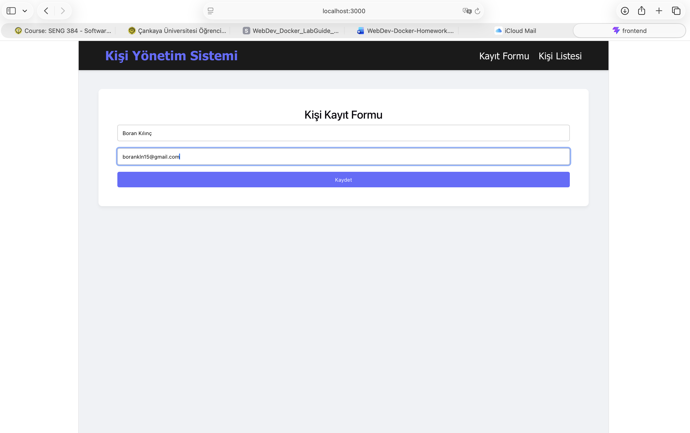
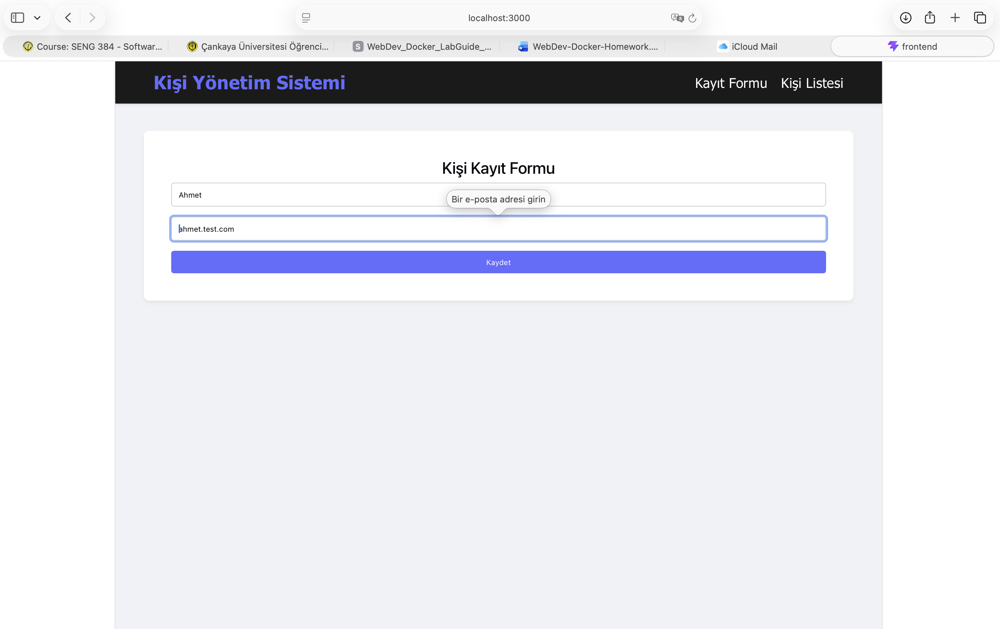
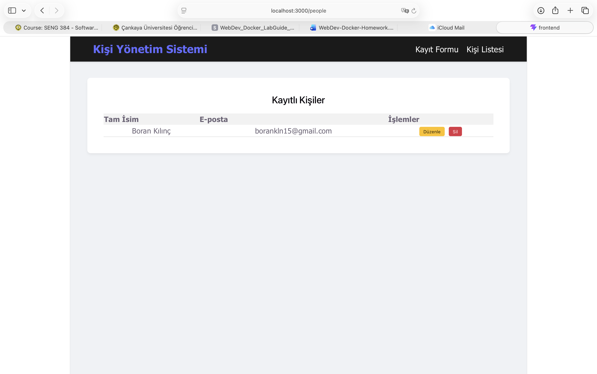
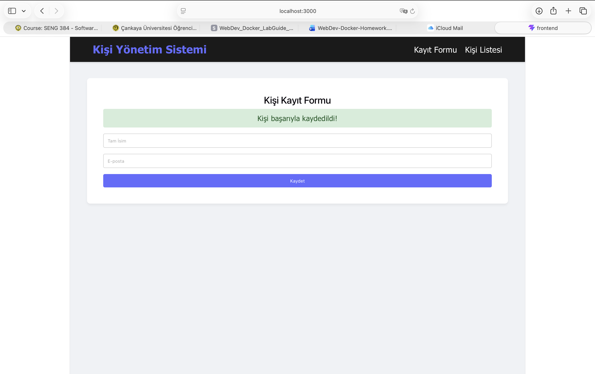
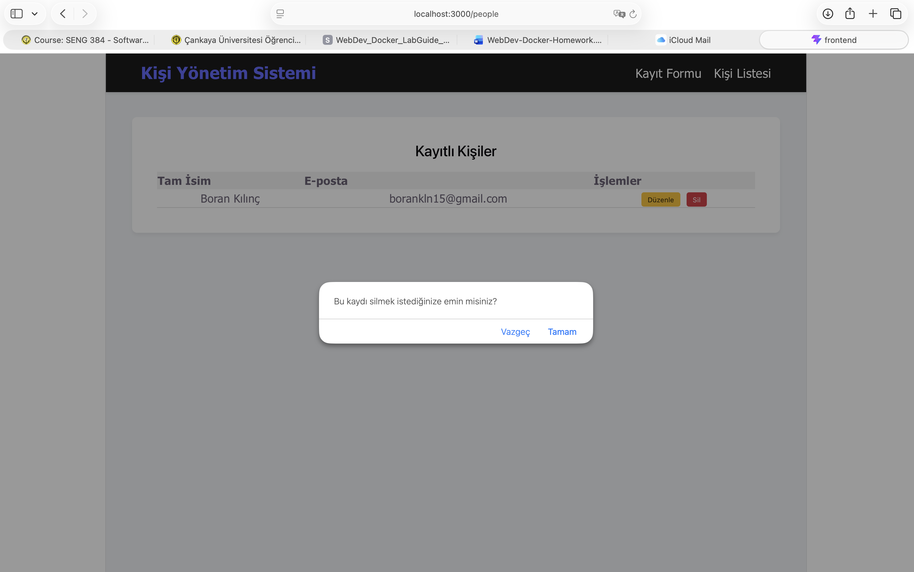
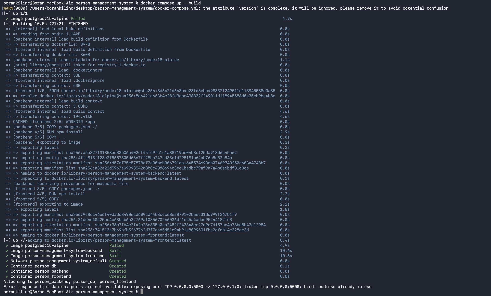

# Person Management System (Full-Stack Docker Project)

Bu proje, modern web teknolojileri kullanılarak geliştirilmiş, konteynerize (Docker) edilmiş bir Kişi Yönetim Sistemi'dir. Kullanıcılar sistem üzerinden yeni kişi kaydı yapabilir, kayıtlı kişileri listeleyebilir, bilgilerini güncelleyebilir veya silebilir (Full CRUD).

## 🚀 Teknolojiler
- **Frontend:** React (Vite), React Router, Axios
- **Backend:** Node.js, Express.js, PostgreSQL (pg)
- **Infrastructure:** Docker & Docker Compose
- **Database:** PostgreSQL 15

---

## 🛠 Kurulum ve Çalıştırma

Projeyi yerel makinenizde çalıştırmak için sisteminizde **Docker** ve **Docker Compose** kurulu olmalıdır.

1. Proje dizinine gidin:
   ```bash
   cd person-management-system

2.  Docker konteynerlerini inşa edin ve başlatın:
    docker-compose up --build

3.  Uygulamaya tarayıcınızdan erişin:

Frontend: http://localhost:3000

Backend API: http://localhost:5001/api (Port 5001, Mac AirPlay çakışmasını önlemek için atanmıştır.)


🌐 API Endpoint Dokümantasyonu
Backend servisi aşağıdaki RESTful uç noktalarını sunmaktadır:

Metot	Endpoint	Açıklama
GET	/api/people	Tüm kayıtlı kişileri veritabanından getirir.
POST	/api/people	Yeni bir kişi oluşturur. (JSON: full_name, email)
PUT	/api/people/:id	Belirtilen ID'ye sahip kişinin bilgilerini günceller.
DELETE	/api/people/:id	Belirtilen ID'ye sahip kişiyi veritabanından siler.


✨ Özellikler
E-posta Doğrulaması: Hem Frontend hem Backend tarafında Regex kullanılarak geçersiz e-posta formatları engellenir.

CRUD İşlemleri: Tam kapsamlı veri yönetimi (Create, Read, Update, Delete).

Hata Yönetimi: Mevcut olan bir e-posta ile kayıt yapılmaya çalışıldığında kullanıcıya uyarı verilir.

Onaylı Silme: Kişi silinmeden önce kullanıcıdan onay (Confirm dialog) istenir.

### 📸 Ekran Görüntüleri

#### 1. Kayıt Formu (Page 1)


#### 2. E-posta Format Kontrolü


#### 3. Kişi Listesi ve CRUD İşlemleri (Page 2)


#### 4. Başarı Mesajı


#### 5. Silme Onay Kutusu


#### 6. Terminal Kurulumu


👤 Geliştirici
İsim Soyisim: [Boran Kılınç]

Öğrenci Numarası: [202228029]

Ders: [SENG384 - DOCKER HOMEWORK]